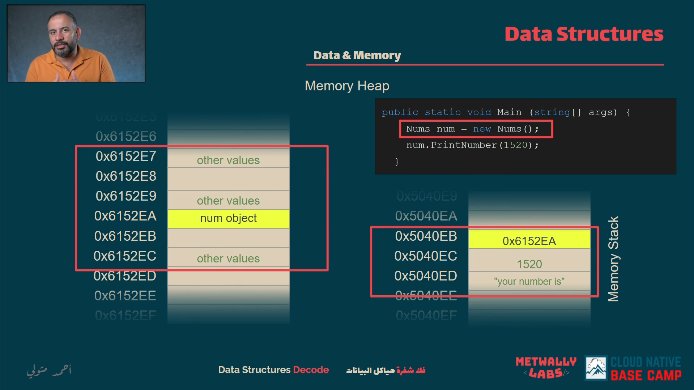

**var num int32 = 1520 &rarr; golang**
**int num = 1520 &rarr; java**
**int32 num = 1520 &rarr; c#**
#### there we used 2 bytes to store this number in memory so we used 16 bits

 **NOTE &rarr; The variable address is the address of the first byte in the variable even if the variable is 2 bytes or 4 bytes or 8 bytes**
- it take the address of the first byte and the other bytes will be stored after it in the memory
<hr>

#### Stack or Memory Stack:
- just regular places in the memory treated differently

**Example:**

```typescript
function main(): void {
  let num = new Nums();
  num.PrintNumber(1520);
  num.PrintNumber(1530);
  num.PrintNumber(1550);
}

class Nums {
  public PrintNumber(num:number): void {
      let str:string = "your number is";
      console.log(str + ":" + num)
  }
}
```
<hr>

**NOTE &rarr; stack easily got out variable from memory when the function end because i need to know the address of the first byte of the variable to get the variable from the memory**

#### Stack Frame or Activation Record:
- it's a part from the stack memory that store the data of the function that we call it

**Another Example:**
  ```typescript
function main2(): void {
  let num = new Nums2();
  num.PrintNumber(1520);
}

class Nums2 {
  public PrintNumber(num:number): void {
    if(num >= 1525) return;
      let str:string = "your number is";
      console.log(str + ":" + num)
      this.PrintNumber(num + 1);
  }
}
```
<hr>

#### Heap or Memory Heap:
&rarr; just regular places in the memory treated differently

&rarr; we store the objects in the heap memory and we store the address of the object in the stack memory to access it
&rarr; if i delete the address of the object from the stack memory in this moment i can't access the object in the heap memory
&rarr; if i don't delete it from the heap memory it will be stored in the heap memory until the program end

